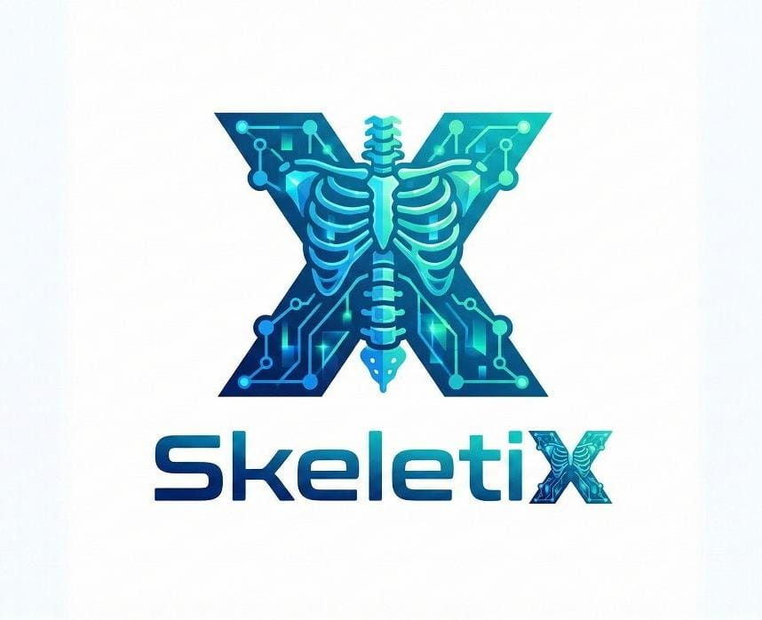
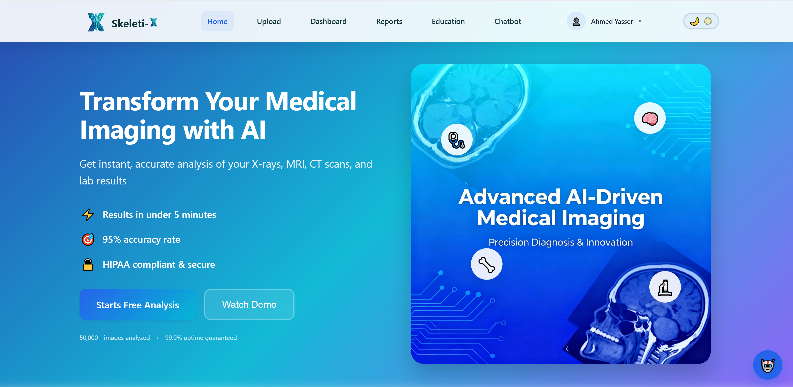
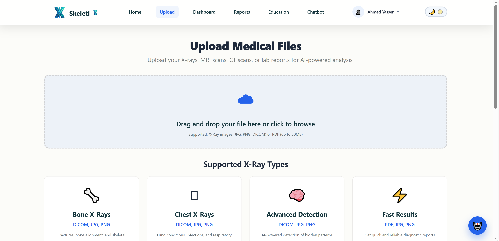
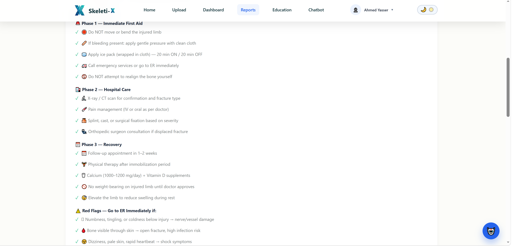
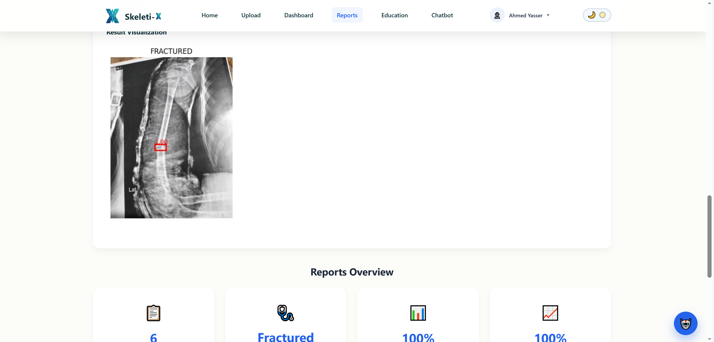
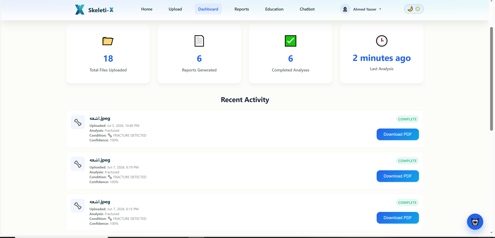
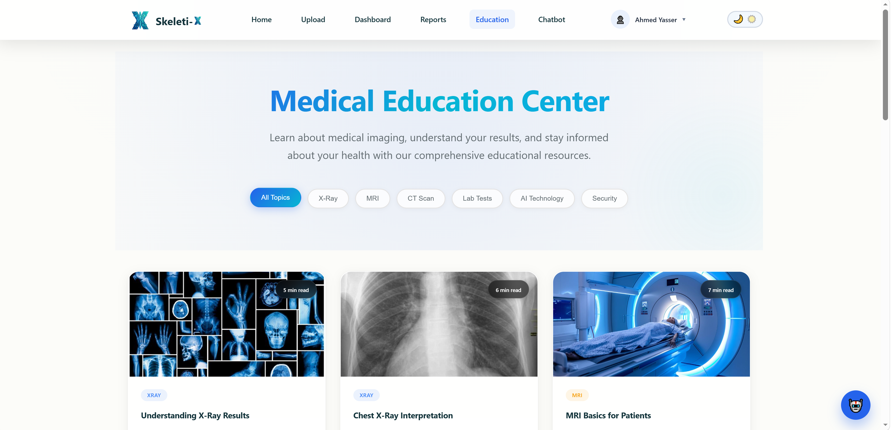
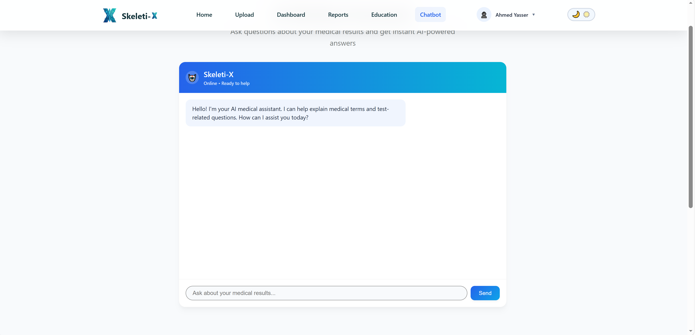

# Skeletix Backend API



## AI-Powered Bone Fracture Detection System Backend

Skeletix Backend is a production-style RESTful API developed using **ASP.NET Core Web API** as part of the graduation project at **The Egyptian E-Learning University (EELU)**.

The backend provides secure and scalable services for an AI-powered healthcare platform that assists medical professionals in analyzing X-ray images, detecting bone fractures, generating reports, and managing patient medical data.

---

# Overview

Skeletix is an intelligent healthcare system that combines **Artificial Intelligence and Backend Engineering** to support faster and more accurate bone fracture analysis.

The backend acts as the core system responsible for:

* User authentication and authorization.
* Patient and medical file management.
* X-ray image upload and processing.
* AI model integration for fracture detection.
* Analysis result management.
* Report generation.
* Dashboard statistics.
* Secure communication with the frontend application.

The system follows a clean and scalable architecture designed for real-world healthcare applications.

---

# Key Features

## Authentication & Security

* JWT Authentication.
* User Registration and Login.
* Role-Based Authorization.
* Secure API endpoints.
* Password hashing and identity management.

## Medical File Management

* Upload X-ray images.
* Store patient medical files.
* Manage analysis history.
* Track medical examination records.

## AI Fracture Analysis Integration

The backend integrates with an Artificial Intelligence model to analyze X-ray images.

The AI service provides:

* Bone fracture detection.
* Confidence score estimation.
* Detection results.
* Medical recommendations.
* Analysis output images.

The backend manages the complete workflow between users, AI services, database, and frontend applications.

## Reports & Dashboard

* Generate medical analysis reports.
* Store analysis results.
* Provide dashboard statistics.
* Monitor system activities.

## API Documentation

* Interactive Swagger/OpenAPI documentation.
* Easy API testing and exploration.

---

# System Architecture

The project follows a layered architecture:

```
Skeletix Backend

│
├── Controllers
│   └── Handle HTTP requests and API endpoints
│
├── Contracts
│   └── Interfaces and service contracts
│
├── Entities
│   └── Database models
│
├── Services
│   └── Business logic implementation
│
├── Persistence
│   └── Database context and configurations
│
├── Migrations
│   └── Entity Framework Core migrations
│
├── Uploads
│   └── Uploaded medical images
│
├── Program.cs
│   └── Application configuration and dependency injection
│
└── appsettings.json
    └── Application settings
```

---

# Technologies Used

## Backend

* ASP.NET Core Web API
* C#
* Entity Framework Core
* SQL Server
* LINQ
* Dependency Injection
* JWT Authentication
* RESTful APIs

## AI Integration

* AI Fracture Detection Model
* REST API Communication
* Image Processing Workflow

## Documentation & Tools

* Swagger / OpenAPI
* Visual Studio 2022
* Git & GitHub

---

# Database

The project uses:

* SQL Server
* Entity Framework Core
* Code First Approach
* Database Migrations

Main responsibilities:

* Store users data.
* Manage medical files.
* Store AI analysis results.
* Maintain system records.

---

# Authentication

Skeletix uses JWT Bearer Authentication.

For protected endpoints, include the generated token in the request header:

```http
Authorization: Bearer YOUR_TOKEN
```

---

# API Documentation

The project provides interactive API documentation using Swagger/OpenAPI.

Run the application and open:

```text
/swagger
```

Example:

```text
https://localhost:7045/swagger
```

## Swagger Screenshots

### Authentication APIs


### Medical Files APIs



### AI Analysis APIs



### 



### Reports APIs



### Dashboard APIs



### Home



### Chatbot



---

# Getting Started

## Clone Repository

```bash
git clone https://github.com/a7medyasser-tech/Skeletix-Backend.git
```

## Navigate to Project

```bash
cd Skeletix-Backend
```

## Restore Dependencies

```bash
dotnet restore
```

## Configure Database

Update the SQL Server connection string inside:

```text
appsettings.json
```

Then apply migrations:

```bash
dotnet ef database update
```

## Run Application

```bash
dotnet run
```

---

# Graduation Project

## Skeletix – AI Bone Fracture Detection System

This backend was developed as part of the graduation project at:

**The Egyptian E-Learning University (EELU)**

Skeletix is an AI-powered healthcare platform designed to assist healthcare professionals in detecting bone fractures from X-ray images.

The system uses Artificial Intelligence to:

* Analyze medical X-ray images.
* Detect possible fractures.
* Estimate confidence levels.
* Provide recommendations.
* Generate structured medical reports.

The backend is responsible for:

* API development.
* Database management.
* Authentication.
* AI model integration.
* Report generation.
* Secure communication between system components.

---

# Future Improvements

* Cloud deployment.
* Advanced medical analytics.
* Real-time notifications.
* Mobile application integration.
* Enhanced AI prediction models.

---

# Author

## Ahmed Yasser

Backend Developer specialized in:

* ASP.NET Core Web API
* C#
* Entity Framework Core
* SQL Server
* Backend System Development

GitHub:

https://github.com/a7medyasser-tech

LinkedIn:

https://www.linkedin.com/in/ahmed-0-yasser

---

# License

This project was developed for educational and graduation project purposes.
